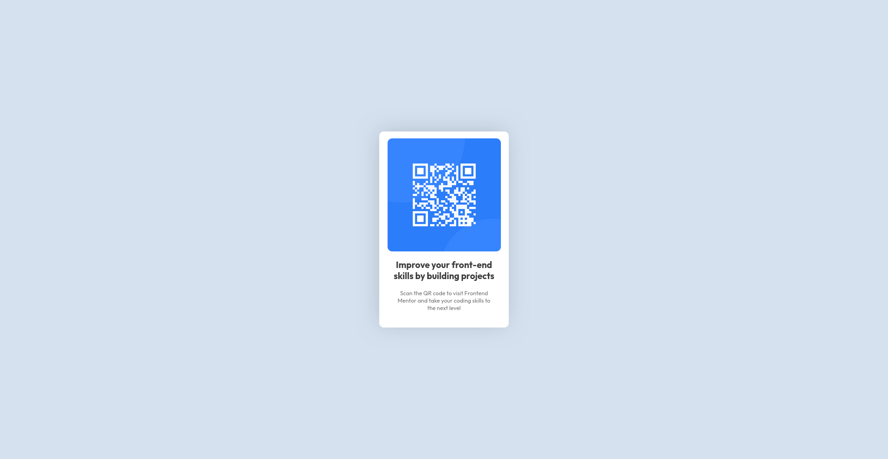

# Frontend Mentor - QR code component solution

This is a solution to the [QR code component challenge on Frontend Mentor](https://www.frontendmentor.io/challenges/qr-code-component-iux_sIO_H). Frontend Mentor challenges help you improve your coding skills by building realistic projects. 

## Table of contents

- [Overview](#overview)
  - [Screenshot](#screenshot)
  - [Links](#links)
- [My process](#my-process)
  - [Built with](#built-with)
  - [What I learned](#what-i-learned)
  - [Continued development](#continued-development)
  - [Useful resources](#useful-resources)
- [Author](#author)


## Overview

### Screenshot



### Links

- Solution URL: [Solution](https://www.frontendmentor.io/solutions/mobile-first-solution-using-flexbox-S_sgclQLd1)
- Live Site URL: [Live Site](https://mandaltuhin.github.io/qr-code-component-main/)

## My process
I have used flexboxs to make this entire page. I have made it mobile first. 

### Built with

- Semantic HTML5 markup
- CSS custom properties
- Flexbox
- Mobile-first workflow


### What I learned

I learned about box-shadow property in CSS.


```css
.main-wrapper{
    /* other code */

    /* box -shadow */
    box-shadow: -3px -3px 47px -7px rgba(0,0,0,0.18);
    -webkit-box-shadow: -3px -3px 47px -7px rgba(0,0,0,0.18);
    -moz-box-shadow: -3px -3px 47px -7px rgba(0,0,0,0.18);
}
```

Here is how to box-shadow property in css works:

```css
box-shadow: offset-x offset-y blur-radius spread-radius color inset;

```

Explanation of each part:

1. offset-x (required)

    - How far to move the shadow horizontally.

    - Positive = to the right, Negative = to the left.

2. offset-y (required)

    - How far to move the shadow vertically.

    - Positive = down, Negative = up.

3. blur-radius (optional)

    - How blurry the shadow is.

    - Higher values = softer and more spread-out edges.

    - Default is 0, meaning sharp edges.

4. spread-radius (optional)

    - How much the shadow expands or contracts.

    - Positive = expands outward, Negative = shrinks inward.

5. color (optional but common)

    - The color of the shadow.

    - Can use any valid CSS color (hex, rgba, named, etc).

6. inset (optional keyword)

    - If present, the shadow will appear inside the box (like an inner shadow).

    - Without inset, it’s the default outer shadow.


### Useful resources

- [Box-Shadow-Generator](https://cssgenerator.org/box-shadow-css-generator.html) - This helped me a lot in figuring out the box-shadow of the centered div. Its a great tool I am looking forword to use in more such scenarios.


## Author

- Website - Tuhin Mandal
- Frontend Mentor - [@MandalTuhin](https://www.frontendmentor.io/profile/MandalTuhin)
- LinkedIn- [@tuhin-mandal-2157102aa](https://www.linkedin.com/in/tuhin-mandal-2157102aa/)
